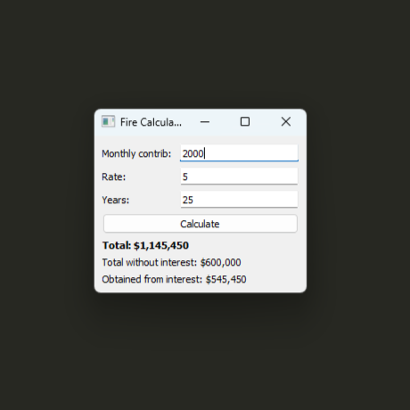

# fire

Financial Independence and Early Retirement Apps.

The main application calculates the return from monthly savings over a given 
number of years and a given annual rate.

## Usage

To install requirements run:

`$ pip install -r requirements.txt`

To run the program:

`$ python main.py`

You can also install a Windows executable, available in the release files.
Or following this [link](https://github.com/HenrYxZ/fire/releases/download/v1.0.0/fire.exe)

## Dependencies

- PyQt5
